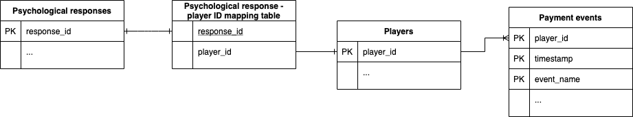

# 12traits Data Engineering challenge

## Problem description
A European game developer company entrusted 12traits to conduct the psychological assessment of one of their games' player base. The game is a post-apocalyptic shooter that can be played in the browser. Besides the psychological responses collected by 12traits, the client has also provided some detailed user and payment-related data.

We would like to ask you to **process these files using the Python programming language (including any tool of your choice with a Python API).** 

The client would like you to **answer the following questions using SQL**:

1. What is my total revenue in EUR?
3. Which players have spent the most? Please provide the player IDs of the top 10.
4. Which browser was the most popular among the users? What about only the paying users?
5. How did the average price paid (in EUR) relate to the average subjective well-being of my players by gender and by country?
6. How many players do I have per country and how many of them were surveyed by 12traits?

**Please push your solution to a new branch and initiate a pull request.**

## Data Sources
All data files can be found in the folder `data/`.

Draft ERD:

### Psychological responses
**Source:** 12traits

The psychological responses collected by 12traits are accessible in the GZIP-compressed TSV file `psych_responses.tsv.gzip`.

Please note that the response IDs under the field `response_id` are different from the `player_id` fields in the other files and only a fraction of players were surveyed by 12traits.

Data schema:

| Column                | Type   | Description  |
| --------------------- |--------| -------------|
| response_id           | string |
| extroversion          | float  | The respondent's extroversion. Measured on a 0-1 scale. Higher value = more extrovertive personality |
| subjective_well_being | float  | A measure of the subjective well-being. Measured on a 0-1 scale. Higher value = higher level of well-being |
| endurability          | float  | A measure of the endurability. Measured on a 0-1 scale. Higher value = more endurability |

### Psychological response - player mapping table
**Source:** client

The file `player_psych_response_mapping_table.csv` contains the mapping between the player identifiers found in the other client-provided files and the psychological responses.

Schema:
| Column      | Type   | Description  |
| ----------- | ------ | ------------ |
| player_id   | string | The player's unique identifer |
| response_id | string | The psychological response's unique identifier |

### Players
**Source:** client

The newline-delimited JSON file (NDJSON) `players.json` contains all the players that have played with the client's game.

| Column      | Type     | Description  |
| ----------- | -------- | ------------ |
| ID          | string   | The player's unique identifer |
| first_name  | string   | The player's first name |
| last_name   | string   | The player's last name |
| address     | string   | The player's home address |
| email       | string   | The player's email address |
| gender      | string   | The player's gender. Female ("F") or male ("M") |
| country     | string   | The ISO 3166-1 alpha-2 of the player's home country |

### Payment events
**Source:** client

The snappy-compressed Parquet file named `payment_events.parquet` contains the successful payment events in an event-sourced format.

| Column      | Type     | Description  |
| ----------- | -------- | ------------ |
| player_id   | string   | The player's unique identifer |
| timestamp   | datetime | The timestamp of the event in the format YYYY-MM-DD HH:MM:SS |
| event_name  | string   | The event's type |
| price_eur   | float    | The price paid in EUR |
| item_id     | string   | The purchased article's unique ID |
| user_agent  | string   | The user agent of the player request |
